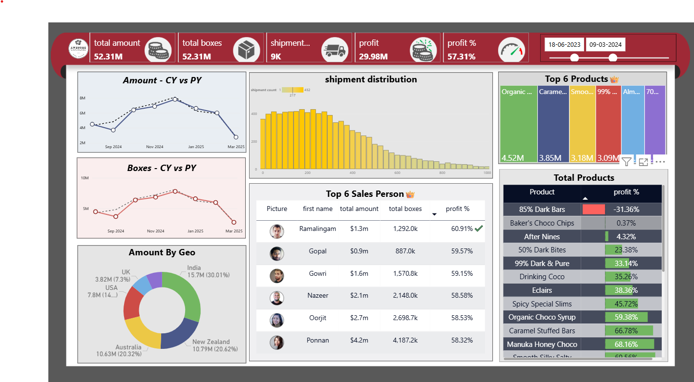

# Awesome Chocolate Sales Dashboard

This is a **Power BI Sales Dashboard** showing sales, shipments, profit, and top products.

## Features

- Total KPIs: Amount, boxes, shipments, profit, and profit %
- Year-over-year sales comparison
- Shipment distribution analysis
- Top 6 products by sales
- Sales by country: India, USA, UK, Australia, New Zealand
- Top 6 salespersons with profit contribution
- Product-level profit % analysis

## Project Structure

📁 awesome-chocolate-sales-dashboard  
 ┣ 📂 screenshots  
 ┃ ┗ 📜 Awesome_dashboard.png  
 ┣ 📜 README.md  
 ┗ 📜 chocolate dashboard.pbix  

## How to Use

1. Clone the repository:  
   `git clone https://github.com/greeshma934/awesome-chocolate-sales-dashboard.git`

2. Open the Power BI file:  
   `chocolate dashboard.pbix` in Power BI Desktop

3. Refresh data if needed

## Author

**Greeshma Rani**  
[GitHub](https://github.com/greeshma934) | [LinkedIn](https://www.linkedin.com/in/greeshma-rani)
